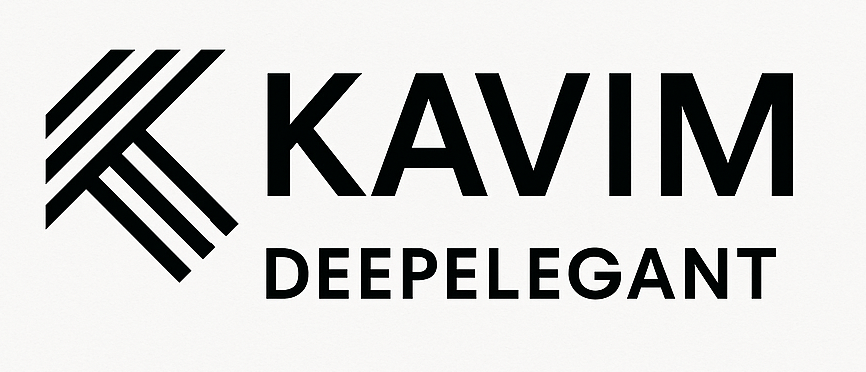
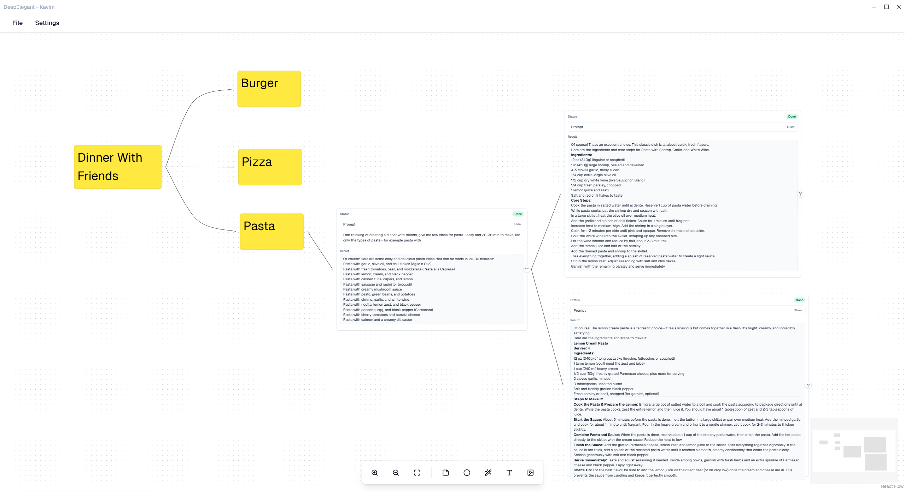

<b>Brainstorm with Friends on a Private AI-Powered Canvas</b>

    <a href="https://kavim.deepelegant.com/"><b>Website</b></a> •
    <a href="https://github.com/deep-elegant/kavim/releases"><b>Releases</b></a> •
    <a href="https://linkedin.com/company/deepelegant"><b>LinkedIn</b></a> •
    <a href="https://docs.kavim.deepelegant.com"><b>Documentation</b></a>

    

**Meet [Kavim](https://kavim.deepelegant.com/)** — the open-source **canvas for brainstorming** with friends (and AIs). Sketch, debate, drop ideas, continue each other’s thoughts, and do it all **privately**, without the chaos of cloud storage or corporate surveillance. 🎨🤝

> Kavim is evolving faster than your group chat’s inside jokes. Your feedback, wild ideas, and bug reports help us shape the future of collaborative creativity. Jump into the Discord or open an issue on [GitHub](https://github.com/deepelegant/kavim/issues).
> We read everything — sometimes twice — and respond before your coffee gets cold. ☕

## 🚀 Installation

Getting started with **Kavim** is simple.
Choose your platform to download the app:

    <a href="https://github.com/deep-elegant/kavim/releases"><b>Windows</b></a> •
    <a href="https://github.com/deep-elegant/kavim/releases"><b>macOS</b></a> •
    <a href="https://github.com/deep-elegant/kavim/releases"><b>Linux</b></a>

## 🌟 Features

**💸 One AI Subscription Is Enough**
Already paying for an AI? Use it here. Connect your existing model and skip the extra “premium” plans.

**👯 Collaborate with Friends & Family**
Brainstorm together in real time

**🧠 Chat with AI & Branch Conversations**
Talk to multiple AIs, follow new threads, and watch ideas evolve on one shared canvas.

**💾 Create & Store Everything Locally**
No clouds. Everything stays right where it belongs — on your device.

**🛡️ Your Data Is Yours (Seriously)**
Your ideas never meet our servers. When you chat with an AI, your data goes _only_ to the model you choose — and that’s it.

## 🛠️ Local development

See [CONTRIBUTING](./CONTRIBUTING.md)

## ⚙️ Built with

## 📸 Screenshots

TBD

## 📝 Documentation

Explore Kavim's [documentation](https://docs.kavim.deepelegant.com/) to learn about features, setup, and usage.

## ❤️ Community

Join our growing community of creators and thinkers on [GitHub Discussions](https://github.com/orgs/deep-elegant/discussions) and our [Discord server](https://discord.com/invite/xTFEu5Q6q6). We follow a respectful, friendly [Code of Conduct](./CODE_OF_CONDUCT.md).

Ask questions, report bugs, suggest features, share your wildest brainstorms, or just hang out and swap AI tips. We’d love to see what you build on your canvas.

## 🤝 Contributing

Want to make the canvas even better? We welcome contributors of all shapes and skill levels.

-   Report [bugs](https://github.com/deep-elegant/kavim/issues) or suggest [new features](https://github.com/deep-elegant/kavim/issues).

-   Help improve our [docs](https://docs.kavim.deepelegant.com/) — from typos to tutorials.

-   Share your creative templates or ideas in [Discord](https://discord.com/invite/xTFEu5Q6q6).

-   Upvote features you’d love to see next.

See our [CONTRIBUTING.md](./CONTRIBUTING.md) to learn how to send your first pull request.

### Contributors

## License

This project is licensed under the [GNU Affero General Public License v3.0](https://github.com/deep-elegant/kavim/blob/master/LICENSE.txt).
